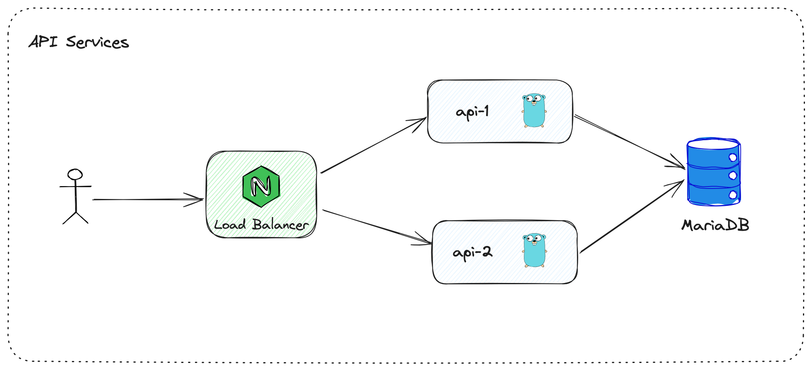
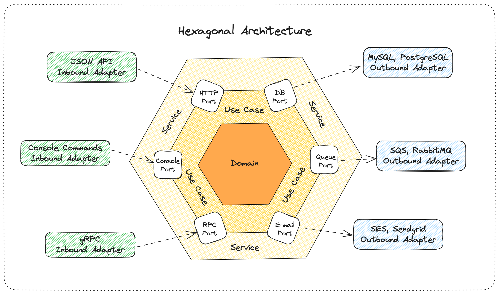

# Crebito - Hexagonal Architecture in GO

This project is part of the [Rinha de Backend - 2024/Q1](https://github.com/zanfranceschi/rinha-de-backend-2024-q1) challenge, which consists of developing an application that is capable of processing a very large volume of concurrent requests (credits and debits) while maintaining the consistency of a current account balance.

## Stack

- GO (`1.22` frameworkless, with routing enhancements ⚡️)
- MariaDB
- Nginx
- Docker

## API Architecture

The API needs to be in two containers, using a database and accessed through a load balance on port 9999, where it will do a round robin distributing the requests.



### Constraints

The total resource limit available for all application services is `550MB` RAM and `1.5` CPU unit.

The distribution of resources for this project was as follows:

| Service       | Memory | CPU unit |
|---------------|-------:|---------:|
| API-1         |   30MB |      0.2 |
| API-2         |   30MB |      0.2 |
| Load Balancer |   20MB |      0.1 |
| Database      |  210MB |      0.7 |
| **Total**     |  290MB |      1.2 |


## Application Architecture

The application was developed using the hexagonal architecture (Ports and Adapters) where the `Use Case` layer represents the application logic, and the `Service layer` the business logic. 



## Running

To create the database container (`rinha-db`) so that you can run the application locally:
```sh
$ make dev
```

To run all the containers (application, database and load balancer) with CPU and memory restrictions already applied. And then you can access it via the url http://localhost:9999/
```sh
$ make prod
```

Removes all containers: `rinha-api1`, `rinha-api2`, `rinha-alb` and `rinha-db`.
```sh
$ make clean
```

Build the Docker image.
```sh
$ make build
```

## Endpoints

The application contains the following REST APIs:

### Create transaction

| Method | Target                      | Description                                                 |
|--------|-----------------------------|-------------------------------------------------------------|
| `POST` | `/clientes/{id}/transacoes` | Creates a credit or debit transaction on the account entered. |

#### Request

Example of body request:
```json
{
  "valor": 1000,
  "tipo" : "c",
  "descricao" : "pix"
}
```
- The value is a positive integer already containing the cents.
- The `tipo` must be `c` for credit and `d` for debit.
- The description cannot be longer than 10 characters.

#### Response

`200` Sucess:
```json
{
  "limite": 100000,
  "saldo": -3000
}
```
- Returns the account limit and the updated balance after processing the transaction.

`422` Unprocessable Entity:
```json
{
  "code": 422,
  "message": "account: insufficient funds"
}
```
- If the account does not have enough to process the transaction.

### List Extracts

| Method | Target                   | Description                                                                                        |
|--------|--------------------------|----------------------------------------------------------------------------------------------------|
| `GET`  | `/clientes/{id}/extrato` | Lists the last 10 transactions made on an account, as well as its current balance and limit value. |

#### Response

`200` Sucess:
```json
{
  "saldo": {
    "total": -3000,
    "data_extrato": "2024-03-10T02:26:14.02115Z",
    "limite": 100000
  },
  "ultimas_transacoes": [
    {
      "valor": 1000,
      "tipo": "c",
      "descricao": "pix",
      "realizada_em": "2024-03-09T23:26:11.669223Z"
    },
    {
      "valor": 2000,
      "tipo": "d",
      "descricao": "pipoca",
      "realizada_em": "2024-03-09T23:25:51.692163Z"
    },
    {
      "valor": 1000,
      "tipo": "d",
      "descricao": "cinema",
      "realizada_em": "2024-03-09T23:25:40.543701Z"
    },
    {
      "valor": 1000,
      "tipo": "d",
      "descricao": "picole",
      "realizada_em": "2024-03-09T23:25:28.527101Z"
    }
  ]
}
```

`404` Not found:
```json
{
  "code": 404,
  "message": "account: not found"
}
```